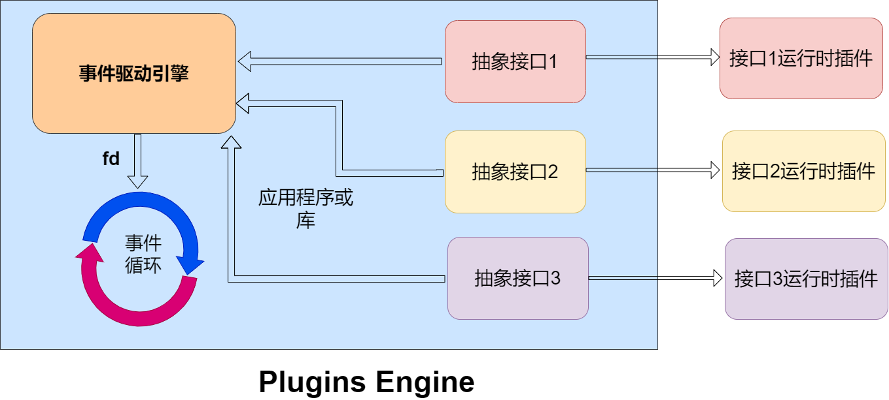

# PluginsEngine

`PluginsEngine` 是一个轻量级事件驱动框架，使用 C++ 实现，支持动态插件的动态加载。`CommAPI` 为多种环境提供现成的抽象用例 API 和运行时插件，而 `PluginsEngine` 则作为 `CommAPI` 项目的驱动框架。

## 依赖倒置设计




## 为什么设计这个框架

所有开发人员都应遵循**依赖倒置原则**，将依赖项隔离在抽象层之后。通过为常见用例提供共享的用例 API，`PluginsEngine` 带来了以下优势：

- **减少相似但不同的抽象 API**：开发人员可以在多个组件中使用相同的 API，简化开发流程。
- **减少运行时插件的数量**：相同的插件可以在所有使用该 API 的程序和库中重复利用。
- **复用现有插件**：能够重复使用现有的运行时插件，并从不断增长的插件集中进行选择和扩展。


##  使用 `PluginsEngine`

### 编译代码

代码编译：

```bash
make build
```
### 安装

```bash
make install
```

### 卸载
```bash
make uninstall
```